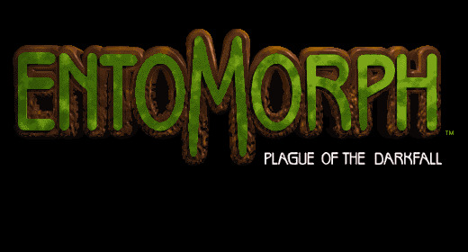
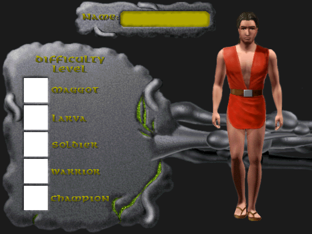
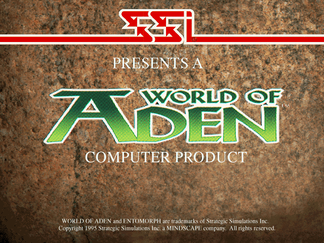

# .LIB File Extension Documentation

The .LIB file format is a container that holds multiple files. The game's executable contains hardcoded information about the names of these files, as the .LIB format itself does not include this data. Below is a Kaitai Struct definition to illustrate the structure of .LIB files.

```ksy
meta:
  id: entomorph_lib
  file-extension: LIB
  endian: le
seq:
  - id: file_count
    type: u4
  - id: file_headers
    type: file_header
    repeat: expr
    repeat-expr: file_count
types:
  file_header:
    seq:
      - id: offset
        type: u4
      - id: size
        type: u4
    instances:
      file_data:
        pos: offset
        size: size
```

The subsequent sections list contents extracted from various .LIB files as determined through decompilation:

## Contents of Specific .LIB Files

### ENGINE/PC.LIB

_Content pending._

### ENGINE/PIC.LIB

Except the file at index 0, these are all [ILBM][ilbm-section] images.

### ENGINE/SPELLS.LIB

_Content pending._

### ENGINE/SYSFILE.LIB

#### ALWAYS.TLB

- File index: 0
- Format: Unknown

#### FX.OJI

- File index: 1
- Format: Unknown

#### NONAME

- File index: 2
- Format: Unknown
- Description: The game doesn't assign a name to this file, but it's assigned to group 6.

#### GENEVA.9

- File index: 3
- Format: Unknown

#### NONAME

- File index: 4
- Format: Unknown
- Description: Not found in the game's executable yet.

#### PLAGUE.18

- File index: 5
- Format: Unknown

#### NONAME

- File index: 6
- Format: Unknown
- Description: The game doesn't assign a name to this file, but it's assigned to group 10.

#### INTERFAC.OJI

- File index: 7
- Format: Unknown

#### PIC.PIC

- File index: 8
- Format: [ILBM][ilbm-section]
- Description: The following image



#### NONAME

- File index: 9
- Format: Unknown
- Description: Not found in the game's executable yet.


#### LOADSAVE.TLB

- File index: 10
- Format: Unknown

#### NONAME

- File index: 11
- Format: Unknown
- Description: The game doesn't assign a name to this file, but it's assigned to group 7.

#### WEPICON.TLB

- File index: 12
- Format: Unknown

#### NONAME

- File index: 13
- Format: Unknown
- Description: Not found in the game's executable yet.

#### INVICON.TLB

- File index: 14
- Format: Unknown

#### LSMSG.TLB

- File index: 15
- Format: Unknown

#### PIC.PIC

- File index: 16
- Format: [ILBM][ilbm-section]
- Description: The following image




#### NONAME

- File index: 17
- Format: Unknown
- Description: Not found in the game's executable yet.

#### CREDITS.TLB

- File index: 18
- Format: Unknown

#### CREDITS.TXT

- File index: 19
- Format: Seems to be text, but contains some binary data
- Description: The game's credits text.

#### NONAME

- File index: 20
- Format: Text
- Description:

It's a list of null terminated strings, this is the content:

```
MOLE
HOME
ANT_A
ANT_B
ANT_C
RAVINE
WEB
ISLANDW
ISLANDC
ISLANDS
VILLAGE
REBELA
REBELB
REBELC
ZIG
MIDWEST
LOWWEST
ISLANDE
LOWCNTR
MIDCNTR
LOWEAST
ANTHILL
BEESURF
BEENEW1
BEENEW2
UNUSED1
UNUSED2
UNUSED3
MANTIS1
MANTIS2
DUNG0
SHRINE1
SHRINE2
S2CAVE
MCAVE
BEEFLY
JOEWEB
```

#### PIC.PIC

- File index: 21
- Format: [ILBM][ilbm-section]
- Description: The following image



[ilbm-section]: HLIBs.md#interleaved-bitmap-ilbm